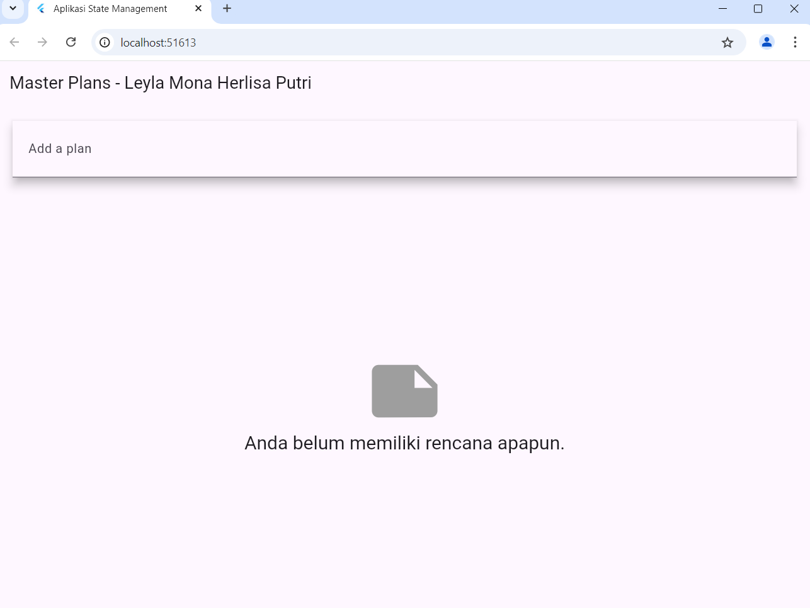

hasil dari project

# Tugas Pratikum 1
1. Jelaskan maksud dari langkah 4 pada pratikum tersebut!mengapa di lakukan demikian?
a.maksud dari langkah 4 adalah menggabungkan ekspor beberapa file model (plan.dart dan task.dart)
ke dalam satu file data_layer.dart

b.menyederhanakan proses impor

c.mempermudah pemeliharaan

d.meningkatkan keterbacaan

e.mendukung sklabilitas

2.Mengapa perlu variabel plan di langkah 6 pada pratikum tersebut? mengapa di buat konstanta?
a.untuk menyimpan data model

b.sebagai sumber data untuk UI

c.memudahkan state management

3. lakukan capture hasil dari langkah 9 beruba GIF, kemudian jelaskan apa yang telah anda buat!

4. Apa kegunaan method pada langkah 11 dan 13 dalam lifecyle state?
langkah 11 kegunaan:
a.diberikan fungsi listener untuk mendeteksi perubahan scroll
b.mengatur state awal seperti pendaftaran event listener di lakukan di sini.

langkah 13 kegunaan :
a.membersihkan sumber daya seperti membebaskan memori an menghentikan kustener yang sebelumnya di tambahkan, mencegah memori leak, yaitu situasi di mana memori yang di gunakan tidak di lepaskan meskipun widget sudah tidak ada

